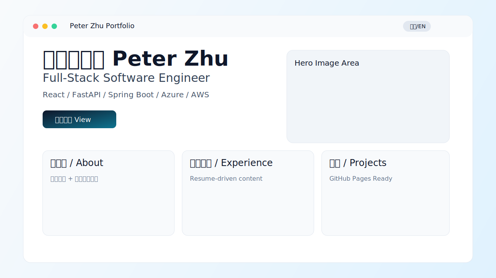

# Peter Zhu Portfolio

中英双语的个人作品集（React + Vite），内容基于简历整理，并已适配 GitHub Pages 部署。

## 在线预览

- GitHub Pages: https://hanyu1234.github.io/Portfolio/
- 仓库地址: https://github.com/Hanyu1234/Portfolio.git

## 项目截图



## 本地开发

```bash
npm install
npm run dev
```

## 构建与发布

```bash
npm run build
```

当前 `vite.config.ts` 已设置：`base: '/Portfolio/'`，用于项目仓库的 GitHub Pages 路径。

## 图片资源存储位置说明

- `public/images/portfolio-preview.svg`
  - README 中展示的项目预览图（仓库内本地静态文件）。
- 页面中的人物/场景图片
  - 目前使用的是外部 URL（Unsplash），定义在：
  - `src/app/components/Hero.tsx`
  - `src/app/components/About.tsx`
  - `src/app/components/Projects.tsx`

如果你希望所有图片都本地化（不依赖外链），我可以帮你把这些图片下载到 `public/images/` 并统一替换引用。
